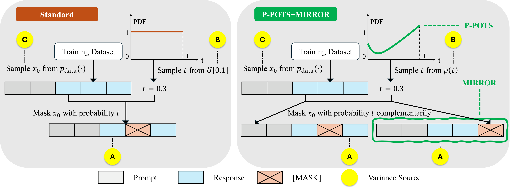
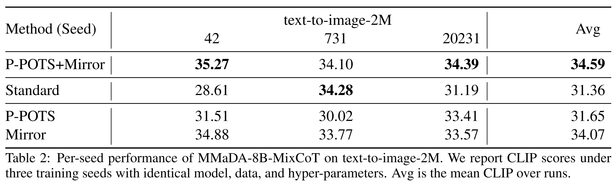

# Bringing Stability to Diffusion: Decomposing and Reducing Variance of Training Masked Diffusion Models

**StableDLLM** is the reference codebase for our work on stabilizing masked diffusion model (MDM) post-training. Building on a variance decomposition of MDM training into **masking pattern noise (A)**, **masking rate noise (B)**, and **data noise (C)**, this repo implements practical variance-reduction recipes—most notably **P-POTS** (a Pareto-optimal unbiased masking-rate sampler) and **MIRROR** (complementary, negatively correlated masking)—to make diffusion language model training (including the **LLaDA** family) substantially more stable and effective.

It provides a lightweight “framework layer” for configuration, training, and evaluation—while keeping the upstream [**LLaDA**](https://github.com/ML-GSAI/LLaDA) code vendored and mostly intact.


<p align="center">
  <a href="assets/paper.pdf">
    
  </a>
</p>

## 🔥 News

- **[2026.02.09]** We released the codebase.
- **[2026.01.26]** Our paper was accepted to ICLR 2026.
- **[2025.11.22]** We posted our paper on [arXiv:2511.18159](https://arxiv.org/abs/2511.18159)

---

## 💡 Main Results

Compared to standard MDM training, our methods boost accuracy by **7–8%** on complex reasoning tasks while reducing run-to-run variability to **near ARM levels**. This substantially narrows the gap to strong ARM baselines; in most settings, even the best baseline runs still fall below the worst run of our method.

<p align="center">
  <a href="assets/table1.png">
    
  </a>
</p>

<p align="center">
  <a href="assets/table2.pdf">
    
  </a>
</p>

---

## MDM Framework

This repo contains two main pieces:

- **`src/mdm/`**: framework + engine(s)
  - a unified training entrypoint (`python -m mdm.train`) with YAML deep-merge + overrides
  - a task registry + evaluation harness (`python -m mdm.eval.harness`)
  - an engine implementation for **LLaDA+** training (`mdm.engines.llada_plus`)
- **`LLaDA/`**: vendored upstream LLaDA repo (tasks, metrics, original sampler, configs, etc.)  
  See `LLaDA/README.md` for upstream-specific notes.

**Why this exists:** evaluation and training scripts for diffusion LMs often hard-code dataset fields and ad-hoc conventions. This repo separates:

- **framework plumbing** (config/registry/eval harness) in `src/mdm/`
- **task packs** (datasets/metrics/adapters) in `LLaDA/llada/`

```
.
├── LLaDA/ # upstream code (sampler, tasks, original configs)
├── src/
│ ├── mdm/ # framework layer + llada_plus training engine
│ ├── llada/ # small legacy CLI wrapper (infer/score)
│ ├── configs/ # MDM + accelerate/deepspeed configs
│ └── tools/ # data preprocessing + eval helpers
├── scripts/ # refactor / smoke scripts
└── tests/ # lightweight unit tests
```

---

## 🛠️ Installation

### Requirements

- Python **3.10+**
- PyTorch, Transformers, Datasets, Accelerate  
- DeepSpeed (optional), WandB (optional)
- `PyYAML` (used by the MDM config loader)

### Setup (from repo root)

```bash
python -m venv .venv
# Linux/macOS:
source .venv/bin/activate
# Windows (PowerShell):
# .venv\Scripts\Activate.ps1

pip install -U pip
pip install -r LLaDA/requirements.txt
pip install pyyaml
```

## 🎯 Quickstart
### 1) Preprocess a training dataset (example: GSM8K)

Training uses a processed JSONL format (see Data format). The repo provides preprocessors under src/tools/preprocess/train/.

Example for GSM8K:

```bash
PYTHONPATH=src:. python src/tools/preprocess/train/preprocess_gsm8k_to_llada.py \
  --out_file ./data/train/gsm8k.jsonl
```

### 2) Train with the unified mdm entrypoint

The training CLI supports multiple YAML files (base + overlays). A typical run uses:

base: src/configs/mdm/base/train_llada_plus.yaml

overlay: LLaDA/configs/llada_gsm8k.yaml (task-specific settings)

```bash
PYTHONPATH=src:. python -m mdm.train \
  --config src/configs/mdm/base/train_llada_plus.yaml \
  --config LLaDA/configs/llada_gsm8k.yaml \
  --auto_import LLaDA.llada.register \
  --set train.output_dir=./outputs/llada_plus_gsm8k
```

To inspect the final merged config without training:

```bash
PYTHONPATH=src:. python -m mdm.train \
  --config src/configs/mdm/base/train_llada_plus.yaml \
  --config LLaDA/configs/llada_gsm8k.yaml \
  --dump_config
```

### 3) Run inference + score (legacy llada CLI)

A small convenience CLI lives at src/llada/cli/main.py:

```bash
PYTHONPATH=src:. python -m llada.cli.main infer \
  --task gsm8k \
  --out_file ./outputs/preds_gsm8k.jsonl \
  --model_name GSAI-ML/LLaDA-8B-Instruct \
  --steps 128 --gen_length 128
```

Then score:

```bash
PYTHONPATH=src:. python -m llada.cli.main score \
  --task gsm8k \
  --pred_jsonl ./outputs/preds_gsm8k.jsonl
```

## Multi-GPU training (Accelerate / DeepSpeed)

The LLaDA+ runner is built on 🤗 Accelerate. For multi-GPU training, use accelerate launch.

Example Accelerate config:

src/configs/accelerate/deepspeed_zero2.yaml

Note: the deepspeed_config_file path in that file may need to point to:

src/configs/deepspeed/zero2_cpu_offload.json

Example launch:

```bash
accelerate launch --config_file src/configs/accelerate/deepspeed_zero2.yaml \
  -m mdm.train \
  --config src/configs/mdm/base/train_llada_plus.yaml \
  --config LLaDA/configs/llada_gsm8k.yaml \
  --auto_import LLaDA.llada.register \
  --set train.output_dir=./outputs/llada_plus_gsm8k_ds
```

## ⚙️ Configuration

The unified entrypoint (python -m mdm.train) merges YAML configs and then dispatches to a training engine.

### Engine: llada_plus

Config keys live under train.* (see src/mdm/train/main.py and src/mdm/engines/llada_plus/cli/train.py).

Common knobs:

- Data
  - train.train_data_path: processed JSONL path (defaults to ./data/train/{task}.jsonl)
  - train.max_len: max token length
  - train.epochs, train.train_ratio
- Optimization
  - train.lr, train.lr_scheduler_type, train.warmup_steps
  - train.batch_size_per_gpu, train.grad_accum
- Eval / checkpoints
  - train.eval_strategy: epoch or steps
  - train.save_strategy: last, epoch, or steps
  - train.output_dir: log/ckpt directory (default: ./logs/{task})
- Diffusion / sampling
  - train.train_mode: Normal or MIRROR
  - train.PPOTS: enable IS-on-t training logic
  - train.p_model: importance sampling model (EPR, AP, ...)
  - plus various IS-related sampling counts and caps

## Data format

### Training (processed JSONL)

The LLaDA+ training engine (mdm.engines.llada_plus) reads a JSONL where each line is a dict:

```json
{"input_ids": [ ... token ids ... ], "prompt_length": 123}
```

- input_ids: tokenized full sequence (prompt + answer)
- prompt_length: prefix length (tokens) that belong to the prompt. Loss is applied only to tokens after this boundary.

The training dataloader will:
- pad sequences in-batch,
- set labels = input_ids but mask out:
  - padding,
  - prompt tokens (labels[:prompt_length] = -100).

This format is produced by preprocess scripts under src/tools/preprocess/train/.

### Inference / scoring JSONL

The legacy llada infer command writes one dict per sample, e.g.:

```json
{
  "task": "gsm8k",
  "prompt": "...",
  "gold_raw": "...",
  "prediction": "...",
  "meta": {"index": 0}
}
```

The scoring helpers (llada score) use robust answer extraction heuristics in LLaDA/llada/eval/.

## Evaluation harness (mdm.eval)

For framework-level evaluation (task-pack driven), use:

```bash
PYTHONPATH=src:. python -m mdm.eval.harness \
  --task llada_gsm8k \
  --pred ./outputs/preds_gsm8k.jsonl \
  --auto_import LLaDA.llada.register
```

If your predictions do not already contain gold answers, you can provide a ground-truth JSONL:

```bash
PYTHONPATH=src:. python -m mdm.eval.harness \
  --task llada_gsm8k \
  --pred ./outputs/preds.jsonl \
  --gt ./data/test/gsm8k_gt.jsonl \
  --auto_import LLaDA.llada.register
```

The task pack (LLaDA/llada/tasks/specs.py) will merge pred and gt by id (preferred) or index.

## Adding a new task

Tasks are registered via mdm.registry with a TaskSpec:

Interface: src/mdm/tasks/spec.py

Registry: src/mdm/registry.py

Minimal pattern:

```python
from mdm.registry import register_task
from mdm.tasks.spec import BaseTaskSpec

class MyTask(BaseTaskSpec):
    name = "my_task"

    def build_dataset(self, split, cfg): ...
    def collate_fn(self, batch): ...
    def postprocess(self, pred, cfg): ...
    def metrics(self, pred_path, gt_path, cfg): ...

register_task("my_task", MyTask())
```

Then evaluate with mdm.eval.harness --task my_task.

## Development & tests

Run the lightweight smoke tests:

```bash
bash scripts/smoke.sh
```

Or directly:

```bash
PYTHONPATH=src:. python -m mdm.debug.smoke_imports
PYTHONPATH=src:. python -m mdm.engines.llada_plus.debug.smoke_test
```

Run unit tests:

```bash
pytest -q
```

## 🙏🏻 Acknowledgements & license

The LLaDA/ subtree is vendored from the upstream [**LLaDA**](https://github.com/ML-GSAI/LLaDA) repository. The framework and glue code in src/mdm are intended to be small and easy to adapt for your own diffusion-LM experiments. We thank the original authors for their open-source contributions.

## ⭐️ Citation

If you find this work useful, please kindly cite:

```bash
@misc{jia2025bringstabilitytodiffusion,
  title        = {Bringing Stability to Diffusion: Decomposing and Reducing Variance of Training Masked Diffusion Models},
  author       = {Mengni Jia, Mengyu Zhou, Yihao Liu, Xiaoxi Jiang, Guanjun Jiang},
  year         = {2025},
  note         = {arXiv preprint arXiv:2511.18159}
}
```